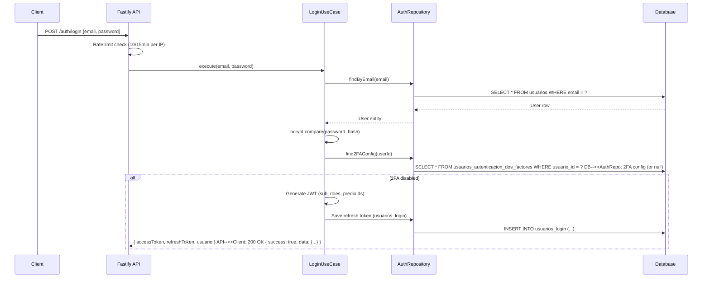
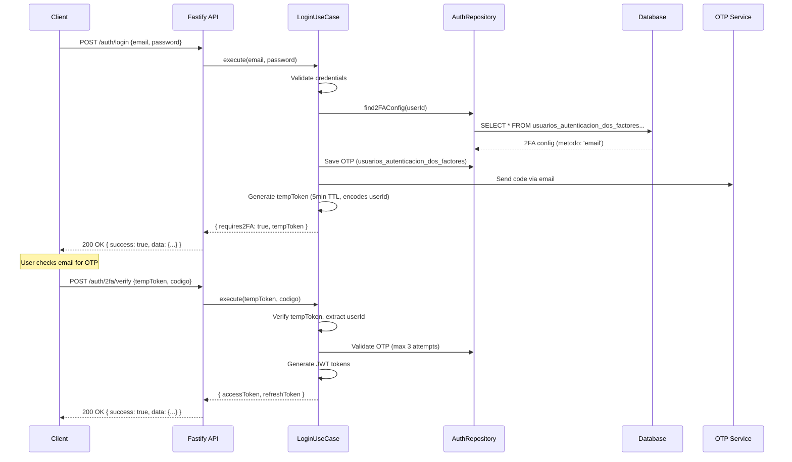
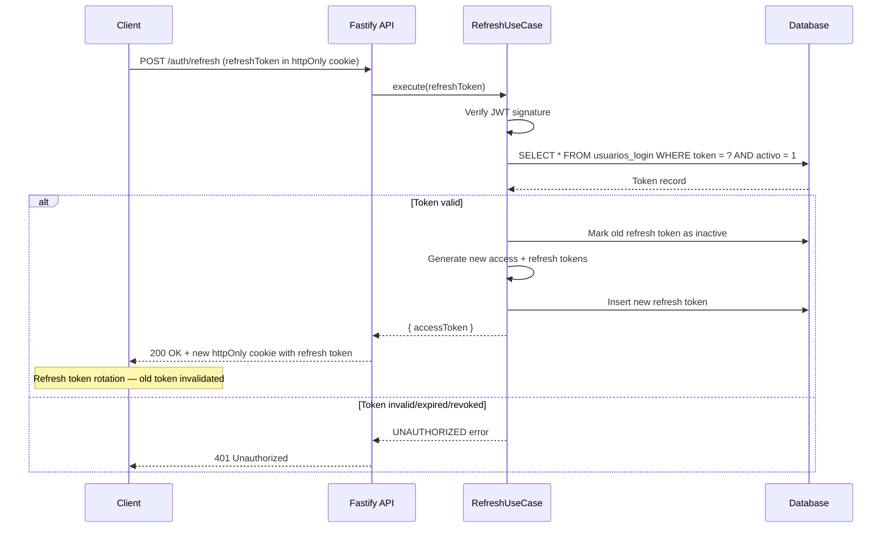
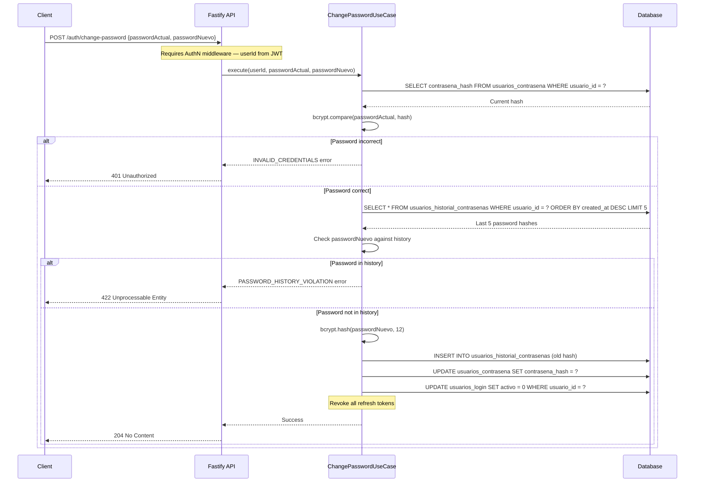

# Design: Backend Foundation

## Technical Approach

This change establishes the foundational backend infrastructure for GanaTrack Phase 1, implementing hexagonal architecture with Drizzle ORM for database abstraction, tsyringe for dependency injection, and Fastify v5 as the HTTP framework. The implementation follows a strict layer-by-layer approach: first infrastructure (database client, DI container, error classes, Fastify plugins), then the Auth module (domain → application → infrastructure), followed by the Usuarios module with RBAC middleware. All code adheres to PRD specifications for multi-tenant security, JWT authentication with refresh token rotation, and two-factor authentication flows.

## Architecture Decisions

### Decision: Hexagonal Module Structure

**Choice**: Strict Ports & Adapters with domain layer isolated from infrastructure
**Alternatives considered**: Layered architecture, MVC
**Rationale**: Hexagonal architecture ensures domain entities have zero framework dependencies, enabling unit testing with mocked repositories and future infrastructure swaps (e.g., replacing Fastify with Express). The clear boundary between domain and infrastructure prevents business logic leakage into controllers.

| Layer | Dependencies | Responsibility |
|-------|--------------|----------------|
| Domain | None (pure TS) | Entities, value objects, repository interfaces, domain services |
| Application | Domain interfaces | Use cases (orchestrators), DTOs |
| Infrastructure | Application + DB | Drizzle repositories, Fastify controllers/routes/schemas, mappers |

### Decision: DI with tsyringe

**Choice**: tsyringe with reflect-metadata for constructor injection**Alternatives considered**: InversifyJS, manual DI, Awilix
**Rationale**: tsyringe is lightweight (~2KB), uses standard TypeScript decorators, and integrates seamlessly with Fastify's lifecycle. The `reflect-metadata` import must be first in `server.ts`. Container registration happens in `container.ts` composition root.

```typescript
// server.ts — reflect-metadata MUST be first
import 'reflect-metadata'
import { buildApp } from './app'

// container.ts — composition root
import { container } from 'tsyringe'
container.registerSingleton(AUTH_REPOSITORY, DrizzleAuthRepository)
```

### Decision: Request Flow with Middleware Chain

**Choice**: Ordered middleware chain: AuthN → TenantContext → AuthZ → Controller
**Alternatives considered**: Single monolithic middleware, route-level guards
**Rationale**: Separating concerns allows independent testing and clear error boundaries. Each middleware has a single responsibility:

1. **AuthN** (JWT verify): Returns 401 if token invalid/missing
2. **TenantContext** (X-Predio-Id validation): Returns 403 if user lacks access to predio
3. **AuthZ** (RBAC check): Returns 403 if permission missing

### Decision: Drizzle ORM Dual Database Support

**Choice**: Single schema definition using `sqliteTable`, runtime provider switch
**Alternatives considered**: Separate schema files per database, Prisma
**Rationale**: Drizzle's type inference works directly from TypeScript schema. Using `sqliteTable` as source of truth with `integer('col', { mode: 'timestamp' })` for datetime compatibility. The client factory reads `DATABASE_PROVIDER` env var and selects SQLite or PostgreSQL driver.

### Decision: Password Security Strategy

**Choice**: bcrypt with cost factor 12, salt embedded in hash, 5-password history
**Alternatives considered**: argon2, scrypt, separate salt storage
**Rationale**: bcrypt's built-in salt handling (`$2b$12$<salt><hash>`) eliminates separate salt management. Cost factor 12 is production-safe (~250ms). History stored in `Usuarios_Historial_Contrasenas` table per PRD §8.4.

## Data Flow

### Request Flow (Hexagonal Architecture)

```
HTTP RequestPOST /auth/login
    │
    ▼[JSON Schema Validation] ──► 400 Bad Request (invalid body)
    │
    ▼[Rate Limit Check] ──► 429 Too Many Requests (if exceeded)
    │
    ▼[AuthN Middleware] ──► 401 Unauthorized (invalid/expired JWT)    │                                └─► Skipped for /auth/login, /auth/refresh
    ▼
[TenantContext Middleware] ──► 400 Missing X-Predio-Id
    │                            └─► 403 Forbidden (predio not in user's predioIds)
    │
    ▼
[AuthZ Middleware] ──► 403 Forbidden (missing permission)
    │
    ▼
[Controller] extracts DTO from request
    │
    ▼
[Use Case] orchestrates business logic
    │
    ▼
[Domain Service] validates domain rules
    │
    ▼
[Repository Interface] (port)
    │
    ▼
[Drizzle Repository] (adapter) queries SQLite/PostgreSQL
    │
    ▼
[Mapper] transforms DB row → Domain → Response DTO
    │
    ▼
HTTP Response { success: true, data: {...} }
```

### Auth Flow: Login without 2FA



### Auth Flow: Login with 2FA



### Token Refresh Flow



### Password Change Flow



## File Changes

| File | Action | Description |
|------|--------|-------------|
| `packages/database/src/schema/security.ts` | Create | Usuarios, contrasena, login, 2FA, roles, permisos, usuarios_predios tables (8 tables) |
| `packages/database/src/schema/predios.ts` | Create | Predios, potreros, sectores, lotes, grupos, parametros_predio tables (6 tables) |
| `packages/database/src/schema/animales.ts` | Create | Animales, animales_imagenes, imagenes tables with self-references (3 tables) |
| `packages/database/src/schema/maestros.ts` | Create | Veterinarios, propietarios, hierros, diagnosticos, motivos, causas, lugares tables (8 tables) |
| `packages/database/src/schema/servicios.ts` | Create | Palpaciones, inseminaciones, partos, veterinarios tables (12 tables) |
| `packages/database/src/schema/configuracion.ts` | Create | Razas, condiciones, tipos, calidades, colores, rangos, key-values tables (7 tables) |
| `packages/database/src/schema/productos.ts` | Create | Productos, productos_imagenes tables (2 tables) |
| `packages/database/src/schema/reportes.ts` | Create | Reportes_exportaciones table (1 table) |
| `packages/database/src/schema/notificaciones.ts` | Create | Notificaciones, preferencias, push_tokens tables (3 tables) |
| `packages/database/src/schema/index.ts` | Create | Barrel export of all schemas |
| `packages/database/src/client.ts` | Create | Drizzle client factory (SQLite/PostgreSQL switch) |
| `packages/database/drizzle.config.ts` | Create | Drizzle Kit configuration |
| `packages/database/seed.ts` | Create | Seed data: catalog tables + default admin user |
| `packages/database/migrations/` | Create | Generated SQL migrations (drizzle-kit generate) |
| `packages/database/package.json` | Modify | Add drizzle-orm, better-sqlite3, postgres, drizzle-kit dependencies |
| `apps/api/src/shared/errors/` | Create | Custom error classes: NotFoundError, ForbiddenError, ValidationError, UnauthorizedError, etc. |
| `apps/api/src/shared/middleware/auth.middleware.ts` | Create | JWT verification hook (preHandler) |
| `apps/api/src/shared/middleware/tenant-context.middleware.ts` | Create | X-Predio-Id extraction and validation |
| `apps/api/src/shared/middleware/rbac.middleware.ts` | Create | Permission check middleware |
| `apps/api/src/shared/types/jwt-payload.ts` | Create | JWT payload interface |
| `apps/api/src/shared/types/tenant-context.ts` | Create | Tenant context interface |
| `apps/api/src/plugins/cors.ts` | Create | CORS configuration plugin |
| `apps/api/src/plugins/jwt.ts` | Create | JWT plugin with secret from env |
| `apps/api/src/plugins/rate-limit.ts` | Create | Rate limiting plugin (10/15min for login, 200/min general) |
| `apps/api/src/container.ts` | Create | tsyringe DI composition root |
| `apps/api/src/app.ts` | Modify | Build Fastify app with plugins and route registration |
| `apps/api/src/server.ts` | Modify | Add reflect-metadata import first, call buildApp() |
| `apps/api/src/modules/auth/domain/entities/usuario.entity.ts` | Create | Usuario domain entity |
| `apps/api/src/modules/auth/domain/entities/login.entity.ts` | Create | Login session entity |
| `apps/api/src/modules/auth/domain/entities/2fa.entity.ts` | Create | 2FA configuration entity |
| `apps/api/src/modules/auth/domain/repositories/auth.repository.ts` | Create | IAuthRepository interface + token |
| `apps/api/src/modules/auth/domain/repositories/usuario.repository.ts` | Create | IUsuarioRepository interface + token |
| `apps/api/src/modules/auth/domain/services/password.service.ts` | Create | Password hashing/validation domain service |
| `apps/api/src/modules/auth/application/use-cases/login.use-case.ts` | Create | Login use case (handles 2FA flow) |
| `apps/api/src/modules/auth/application/use-cases/logout.use-case.ts` | Create | Logout use case (revoke refresh token) |
| `apps/api/src/modules/auth/application/use-cases/refresh.use-case.ts` | Create | Token refresh use case (rotation) |
| `apps/api/src/modules/auth/application/use-cases/verify-2fa.use-case.ts` | Create | 2FA verification use case |
| `apps/api/src/modules/auth/application/use-cases/change-password.use-case.ts` | Create | Password change use case (history check) |
| `apps/api/src/modules/auth/application/dtos/` | Create | Request/response DTOs for auth flows |
| `apps/api/src/modules/auth/infrastructure/persistence/drizzle-auth.repository.ts` | Create | Drizzle implementation of IAuthRepository |
| `apps/api/src/modules/auth/infrastructure/persistence/drizzle-usuario.repository.ts` | Create | Drizzle implementation of IUsuarioRepository |
| `apps/api/src/modules/auth/infrastructure/http/routes/auth.routes.ts` | Create | Auth route registration (/auth/*) |
| `apps/api/src/modules/auth/infrastructure/http/controllers/auth.controller.ts` | Create | Auth controller (thin, delegates to use cases) |
| `apps/api/src/modules/auth/infrastructure/http/schemas/auth.schema.ts` | Create | JSON Schema for login, refresh, 2fa endpoints |
| `apps/api/src/modules/auth/infrastructure/mappers/usuario.mapper.ts` | Create | DB row → Domain → DTO transformation |
| `apps/api/src/modules/auth/index.ts` | Create | Barrel export + registerAuthRoutes function |
| `apps/api/src/modules/usuarios/domain/entities/` | Create | Usuario, Rol, Permiso domain entities |
| `apps/api/src/modules/usuarios/domain/repositories/` | Create | Repository interfaces + tokens |
| `apps/api/src/modules/usuarios/application/use-cases/` | Create | CRUD use cases for users, roles, permissions |
| `apps/api/src/modules/usuarios/infrastructure/persistence/` | Create | Drizzle repository implementations |
| `apps/api/src/modules/usuarios/infrastructure/http/` | Create | Routes, controllers, schemas for /usuarios/* |
| `apps/api/src/modules/usuarios/index.ts` | Create | Barrel export + registerUsuariosRoutes function |
| `apps/api/vitest.config.ts` | Create | Vitest configuration for API tests |
| `packages/database/vitest.config.ts` | Create | Vitest configuration for database tests |
| `packages/shared-types/src/schemas/user.schema.ts` | Modify | Fix User.id type from UUID to integer |

## Interfaces / Contracts

### Repository Interfaces

```typescript
// modules/auth/domain/repositories/auth.repository.ts
import { Usuario } from '../entities/usuario.entity'
import { LoginSession } from '../entities/login.entity'

export interface IAuthRepository {
  findUsuarioByEmail(email: string): Promise<Usuario | null>
  findUsuarioWithRolesAndPredios(userId: number): Promise<{ usuario: Usuario; roles: string[]; predioIds: number[] } | null>
  createLoginSession(userId: number, refreshToken: string): Promise<LoginSession>
  findActiveRefreshToken(token: string): Promise<LoginSession | null>
  revokeRefreshToken(token: string): Promise<void>
  revokeAllUserTokens(userId: number): Promise<void>
  getPasswordHistory(userId: number, limit: number): Promise<string[]>
  savePasswordHistory(userId: number, hash: string): Promise<void>
}export const AUTH_REPOSITORY = Symbol('IAuthRepository')
```

### JWT Payload Interface

```typescript
// shared/types/jwt-payload.ts
export interface JwtPayload {
  sub: number           // userId
  roles: string[]       // ['ADMIN', 'VETERINARIO']
  predioIds: number[]   // [1, 2, 5]
  iat: number
  exp: number
}
```

### Tenant Context Interface

```typescript
// shared/types/tenant-context.ts
export interface TenantContext {
  predioId: number
  usuarioId: number
  roles: string[]
}
declare module 'fastify' {
  interface FastifyRequest {
    tenantContext?: TenantContext
  }
}
```

### Permission Middleware Contract

```typescript
// shared/middleware/rbac.middleware.ts
export function authorize(requiredPermission: string): preHandlerHookHandler
// Usage: app.get('/animales', { preHandler: [app.authorize('animales:read')] }, handler)
```

## Testing Strategy

| Layer | What to Test | Approach |
|-------|-------------|----------|
| Domain | Password hashing/validation, 2FA code generation | Vitest unit tests with pure TS (no DB) |
| Application | Login use case (with/without 2FA), refresh token rotation | Vitest unit tests with mocked repositories |
| Infrastructure | Drizzle repositories (find, create, update, soft-delete) | Vitest integration tests with in-memory SQLite |
| HTTP | Auth endpoints (login, refresh, 2FA verify), usuarios CRUD | Fastify inject() for E2E tests |
| Middleware | JWT validation, tenant context, RBAC permission check | Fastify inject() with mock JWT tokens |

### Test File Structure

```
apps/api/src/modules/auth/
├── domain/services/__tests__/
│   └── password.service.spec.ts
├── application/use-cases/__tests__/
│   ├── login.use-case.spec.ts
│   ├── refresh.use-case.spec.ts
│   └── change-password.use-case.spec.ts
└── infrastructure/http/__tests__/
    └── auth.routes.spec.ts
```

## Migration / Rollout

### Phase 1a: Database Schema
1. Create all 55 table schemas in `packages/database/src/schema/`
2. Run `drizzle-kit push` against SQLite dev database
3. Validate foreign key constraints
4. Execute seed.ts to populate catalog tables + admin user

### Phase 1b: Infrastructure
1. Create database client factory
2. Set up DI container (`container.ts`)
3. Create shared error classes
4. Create Fastify plugins (cors, jwt, rate-limit)

### Phase 1c: Auth Module
1. Implement domain entities and repository interfaces
2. Implement use cases (login, refresh, logout, 2fa, change-password)
3. Implement Drizzle repositories
4. Create controllers and routes
5. Write unit tests for use cases

### Phase 1d: Usuarios Module
1. Implement domain entities (Usuario, Rol, Permiso)
2. Implement use cases (CRUD, role assignment)
3. Implement Drizzle repositories
4. Create controllers and routes with RBAC middleware
5. Write unit and integration tests

### Rollback Plan
- **Database**: `drizzle-kit drop` removes last migration; SQLite dev.db can be deleted and re-seeded
- **Code**: Each module is self-contained; delete `apps/api/src/modules/{auth,usuarios}` and shared infrastructure
- **Git**: `git revert` to previous commit before backend-foundation

## Open Questions

- [ ] ShouldTwoFA OTP codes be stored hashed or plaintext in `usuarios_autenticacion_dos_factores`? (PRD doesn't specify — recommend hashed for security)
- [ ] What is the default admin password for seed data? (Suggest: `Admin123!` with force-change flag)
- [ ] Should permission resolution be cached per-request or per-session? (Recommend: per-request for now, Redis cache in Phase 4)

## Sequence Diagrams (Mermaid Source)

See inline Mermaid diagrams in Data Flow section for:
- Login without 2FA
- Login with 2FA
- Token refresh
- Password change